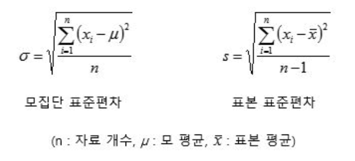

알아봅시다
{: .notice--warning}

# [var](#link){: .btn .btn--primary}{: .align-center}

> ## 공식 문서

> pyspark.sql.functions.var_pop(col)

- Aggregate function: returns the sum of all values in the expression.
- New in version 1.3.

.... 

> Note

- 이떄 주의하셔야 될것은, spark 는 표본표준편차 뿐만 아니라 모 표준편차도 지원한다는 점입니다.



- 그러므로 작 구분해서 사용하는것이 좋습니다 .
  - 모 표준편차를 사용하려면 stddev_pop / 표본 표준편차를 사용하려면 stddev_samp 를 사용하세요

> ## 설명

```python
from pyspark.sql.functions import var_pop, stddev_pop
from pyspark.sql.functions import var_samp, stddev_samp
df.select(var_pop("Quantity"), var_samp("Quantity"),
  stddev_pop("Quantity"), stddev_samp("Quantity")).show()
```

```
+------------------+------------------+--------------------+---------------------+
| var_pop(Quantity)|var_samp(Quantity)|stddev_pop(Quantity)|stddev_samp(Quantity)|
+------------------+------------------+--------------------+---------------------+
|47559.303646609056|47559.391409298754|  218.08095663447796|   218.08115785023418|
+------------------+------------------+--------------------+---------------------+

```


---

**Reference**

- 스파크 완벽 가이드
- 스파크 공식 Docs

